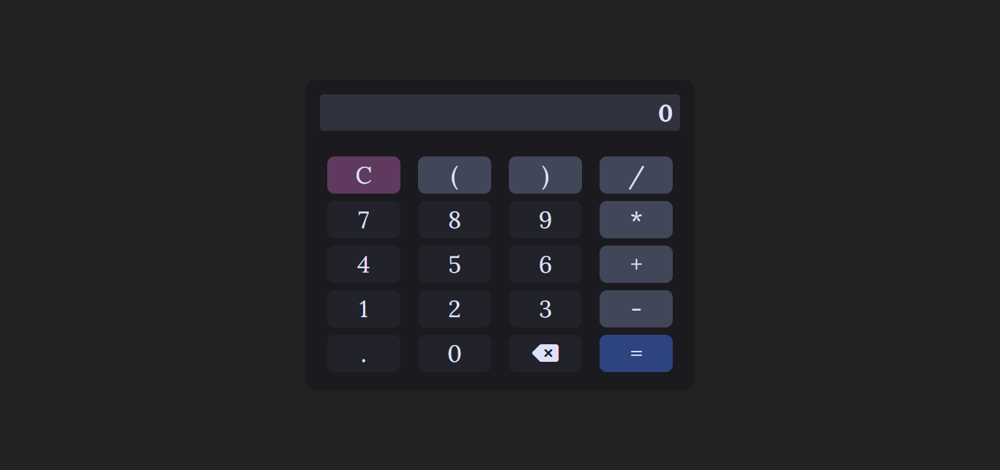

# Calculadora em TypeScript
Este projeto é uma calculadora básica criada em TypeScript com recursos de Programação Orientada a Objetos (POO). Ela foi desenvolvida para fins educacionais, demonstrando a utilização de TypeScript e a interação com o DOM para criar uma interface interativa.
 
 

